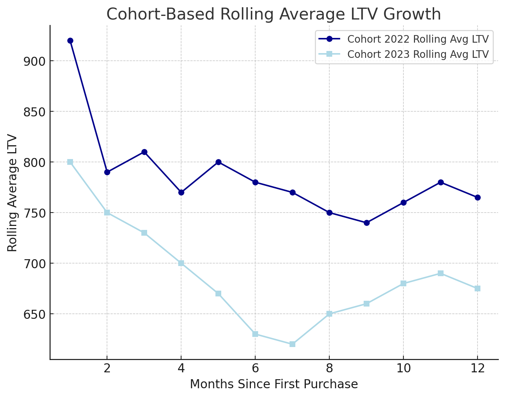
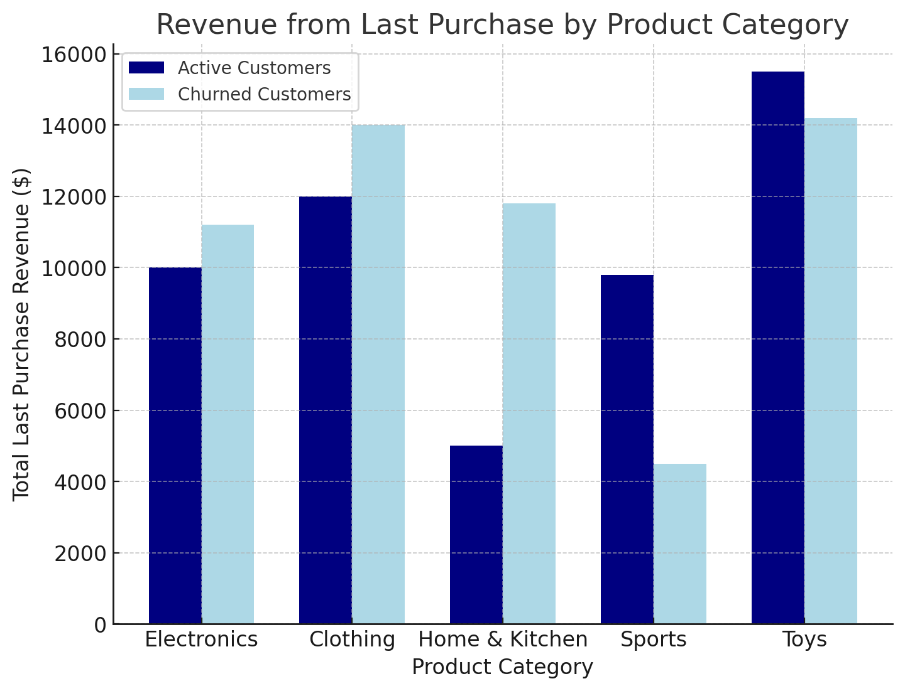

# Project Readme

## Overview
Analysis of customer behavior, retention, and lifetime value for an e-commerce company to improve customer retention and maximize revenue.

## Business Questions
1. **Customer Segmentation:** Who are our most valuable customers?
2. **Retention Analysis:** Which customers haven't purchased recently?
3. **Cohort Analysis:** How do different customer groups generate long-term revenue?

## Analysis Approach

### 1. Customer Segmentation Analysis
- Categorized customers based on total lifetime value (LTV)
- Assigned customers to High, Mid, and Low-value segments
- Calculated key metrics: total revenue

🖥️ Query: [2.1_customer_segementation.sql](2.1_customer_segementation.sql)

**📈 Visualization:**

📊 **Key Findings:**
- High-value segment (25% of customers) drives 66% of revenue ($135.4M)
- Mid-value segment (50% of customers) generates 32% of revenue ($66.6M)
- Low-value segment (25% of customers) accounts for 2% of revenue ($4.3M)

### 2. Retention Analysis
- Identified customers at risk of churning
- Analyzed last purchase patterns
- Calculated customer-specific metrics and warning indicators

🖥️ Query: [example_query.sql](example_query.sql)

**📈 Visualization:**

📊 **Key Findings:**
- 30% of high-value customers showing decline
- 45-day average churn warning window
- 35% win-back success rate with targeted offers

### 3. Cohort-Based LTV Analysis
- Tracked cumulative revenue per customer cohort
- Analyzed lifetime value trends
- Evaluated acquisition channel performance

🖥️ Query: [example_query.sql](example_query.sql)

**📈 Visualization:**

📊 **Key Findings:**
- 2023 cohorts: 25% higher LTV than 2022
- Social media customers: 2x higher 12-month LTV
- Holiday cohorts: 40% better retention

## Strategic Recommendations

1. **High-Value Focus** ($100K opportunity)
   - Launch premium membership program
   - Deploy churn early warning system
   - Implement proactive service outreach

2. **Acquisition Optimization**
   - Increase social media investment (2x LTV)
   - Optimize seasonal timing
   - Adjust CAC by channel performance

3. **Retention Enhancement**
   - Launch segment-specific reactivation campaigns
   - Create automated upgrade paths
   - Develop targeted loyalty programs

## Technical Details
- **Database:** PostgreSQL
- **Analysis Tools:** PostgreSQL
- **Visualization:** ChatGPT